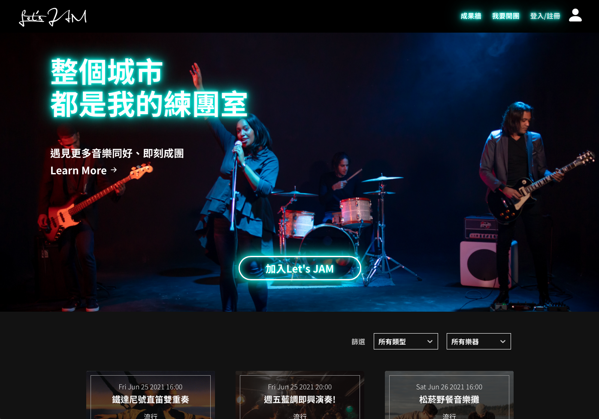
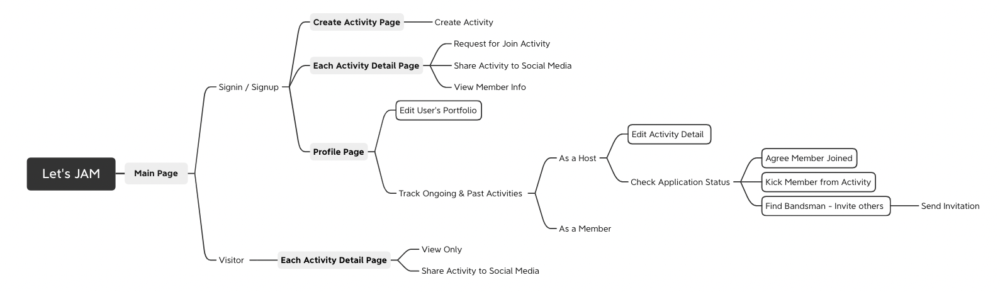

# Let's JAM

A website that allows users to organize music groups, bring people with similar tastes in music together.

## Demo

<a href="https://personalproject-33263.web.app/"><strong>View Website »</strong></a>

Test Account: 
User: test@gmail.com 
Password: 000000

## Technologies

### Front-End Fundamental

- HTML / CSS / JavaScript
- RWD

### Front-End Frameworks

- React (Hook)
- React Router
- Redux
- Styled Component

### Firebase Services

- Authentication
- Firestore Database
- Storage

## Flow Chart

## Features

- Applied React / React Router for SPA, and applied state management by Redux.
- Used Firebase Authentication, Firestore, Storage for data management.
- Applied Google Place Autocomplete in searching places, and deployed automatically date/time picker to deliver an efficient experience when creating an event.
- Implemented filter for activities and members by using data tag, which helps the user pick up an appropriate group and approach suitable bandsman.
- Adopted event pages by utilizing pagination for better user experience.
- Created mobile-friendly interface by RWD.
- Optimized component style by customizing Material-UI for design consistency.

## Website Demo

### Main Page

### Activity Detail Page

- Show Activity Info
- Show Attendants Info

### Profile Page

- Check User's Activity
- Edit Portfolio
- Edit Activity Info Host by User
- Send Invitation

## Future Features

- Activity Gallery
- Create customized message when send invitation

## Contact

Email: peter840101@gmail.com
